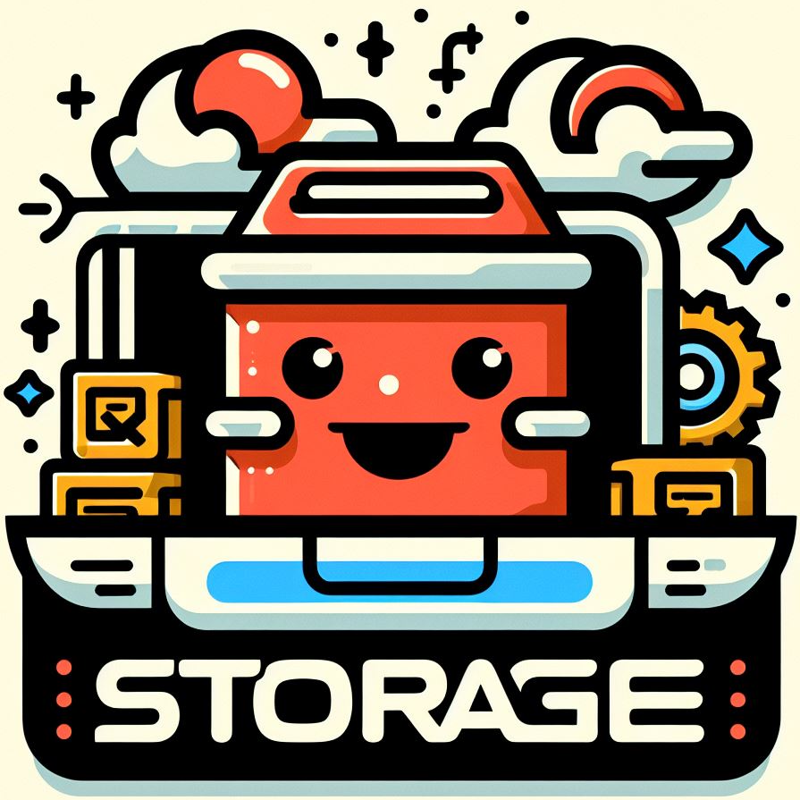

<p align="center"><a href="https://github.com/renzp94/storage" target="_blank" rel="noopener noreferrer"></a></p>
<p align="center">
  <a href="https://codecov.io/github/@renzp/storage"></a>
  <a href="https://npmcharts.com/compare/@renzp/storage?minimal=true"></a>
  <a href="https://www.npmjs.com/package/@renzp/storage"></a>
  <a href="https://www.npmjs.com/package/@renzp/storage"></a>
  <a href="https://www.npmjs.com/package/@renzp/storage"></a>
</p>
<p align="center">
  <a href="https://github.com/renzp94/storage/watchers"></a>
  <a href="https://github.com/renzp94/storage/stars"></a>
</p>

# storage

一款零依赖、快速灵活、简单易用的localStorage API库

## 安装

```sh
npm install @renzp/storage
```

# 使用

```ts
import storage from '@renzp/storage'

const token = 'WEB_TOKEN'

// 设置值
storage.set(token, 'UwhbBh1qzxHXMetSIRI3mQ1X')
// 获取值
const test = storage.get<string>(token)
// 清除值
storage.remove(token)
```